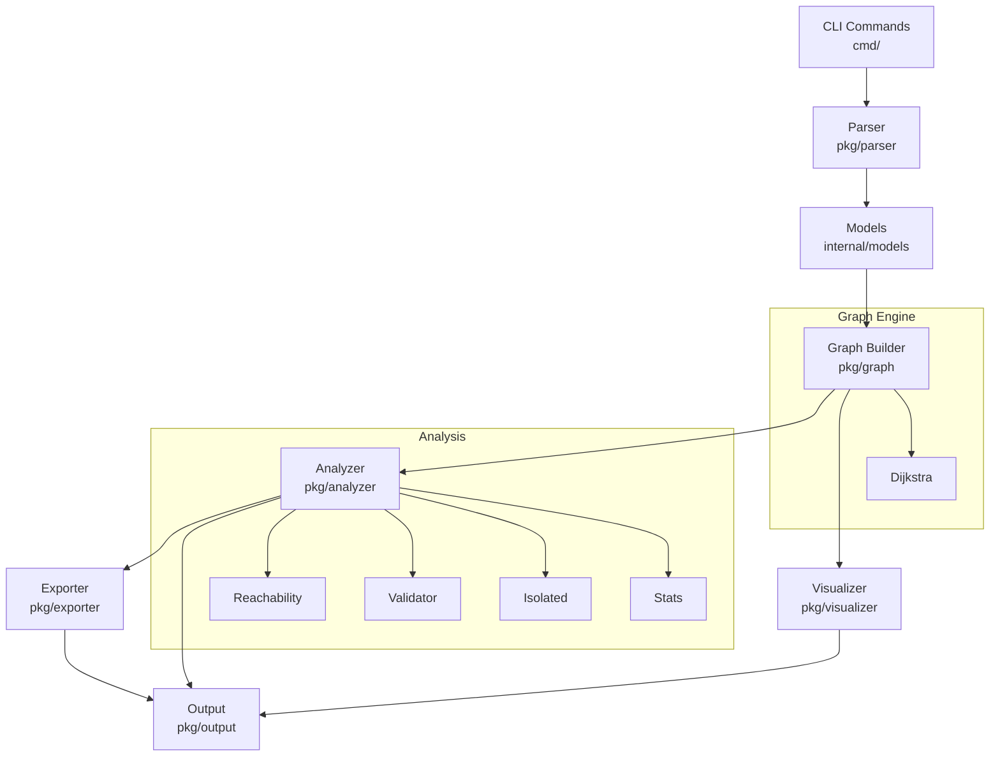

# 🗺️ NetMapper — Network Topology Visualizer

> Map, analyze, and export your network topology from the terminal.

[](https://golang.org)
[](LICENSE)
[](https://github.com/spf13/cobra)
[](https://github.com/go-yaml/yaml)

---

<p align="center">
  
</p>

---

<table>
  <tr>
    <td></td>
    <td></td>
  </tr>
  <tr>
    <td></td>
    <td></td>
  </tr>
</table>

---

## Features

- 📄 Load topology from **YAML or JSON** config files
- 🖥️ Supports node types: `router`, `switch`, `server`, `gateway`, `firewall`
- 🔍 **Dijkstra shortest path** between any two nodes with latency cost
- 🚨 Detect **unreachable nodes**, isolated clusters, and invalid connections
- ✅ **Config validation** — duplicate nodes, self-loops, missing refs, negative latency
- 🌐 **ASCII graph** rendering directly in the terminal
- 📊 **Connection matrix** — visual latency grid across all nodes
- 📈 **Summary statistics** — total nodes, avg degree, type distribution
- 📤 **Export** reports as JSON, CSV, or plain text
- 🎨 Colorized output — green healthy, yellow warnings, red errors
- ⚖️ Weighted connections (latency values in milliseconds)

---

## CLI Commands

| Command | Description |
|---|---|
| `netmapper visualize --config <file>` | Render ASCII graph of the topology |
| `netmapper validate --config <file>` | Validate config for schema errors |
| `netmapper path --from <a> --to <b> --config <file>` | Shortest path between two nodes |
| `netmapper analyze --config <file>` | Full topology analysis report |
| `netmapper matrix --config <file>` | Show connection matrix |
| `netmapper export --config <file> --format json` | Export report (json/csv/text) |
| `netmapper nodes --config <file>` | List all nodes with details |
| `netmapper version` | Show version info |

---

## Example Config

```yaml
nodes:
  - name: gateway-1
    type: gateway
    status: active
  - name: router-1
    type: router
    status: active
  - name: server-1
    type: server
    status: active
  - name: server-2
    type: server
    status: active

connections:
  - from: gateway-1
    to: router-1
    latency: 5
  - from: router-1
    to: server-1
    latency: 10
  - from: router-1
    to: server-2
    latency: 15
```

---

## Tech Stack

| Component | Library |
|---|---|
| CLI framework | [cobra](https://github.com/spf13/cobra) |
| Configuration | [viper](https://github.com/spf13/viper) |
| YAML parsing | [go-yaml v3](https://github.com/go-yaml/yaml) |
| JSON parsing | `encoding/json` (stdlib) |
| Table output | [tablewriter](https://github.com/olekukonko/tablewriter) |
| Colors | [fatih/color](https://github.com/fatih/color) |
| Shortest path | Dijkstra (custom, stdlib only) |

---

## Architecture



---

## Prerequisites

- Go 1.21 or higher
- Git
- make (optional, for Makefile shortcuts)

---

## Install & Run Locally

```bash
# Clone the repository
git clone https://github.com/mdryaan/netmapper.git
cd netmapper

# Download dependencies
go mod tidy

# Build the binary
go build -o netmapper ./...

# Run
./netmapper --help
```

Or install globally:

```bash
go install github.com/mdryaan/netmapper@latest
```

---

## Example Usage

```bash
# Visualize a topology
./netmapper visualize --config examples/simple.yaml

# Validate a config
./netmapper validate --config examples/invalid.yaml

# Find shortest path
./netmapper path --from gateway-1 --to server-2 --config examples/simple.yaml

# Full analysis
./netmapper analyze --config examples/complex.yaml

# Show connection matrix
./netmapper matrix --config examples/simple.yaml

# List all nodes
./netmapper nodes --config examples/complex.yaml

# Export report
./netmapper export --config examples/simple.yaml --format json
./netmapper export --config examples/simple.yaml --format csv --output report.csv
./netmapper export --config examples/simple.yaml --format text --output report.txt
```

---

## Contributing

See [CONTRIBUTING.md](CONTRIBUTING.md) for dev setup, how to add new commands, exporters, and node types.

---

## License

MIT © 2026 [Md Raiyan](https://github.com/mdryaan)
